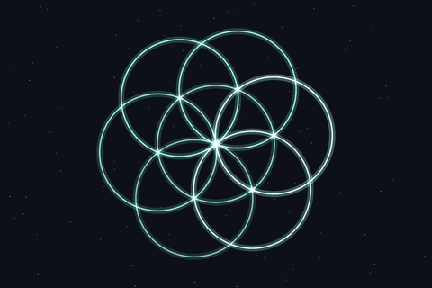

# terella

Long-horizon agent workflows with a human in the loop.

  

Terella coordinates repeatable workflows across desktop, CLI, web, and CI for high-consequence software systems—including identity and trust, clinical operations, payments and settlement, data planes and analytics, developer tooling, automation, and production operations.

We are currently keeping distribution private while we review safety and establish mediated access for potentially high-impact use cases.

Interested in learning more or evaluating Terella?

**[Contact us at contact@terella.dev](mailto:contact@terella.dev)**

[Visit terella.dev](https://terella.dev)
